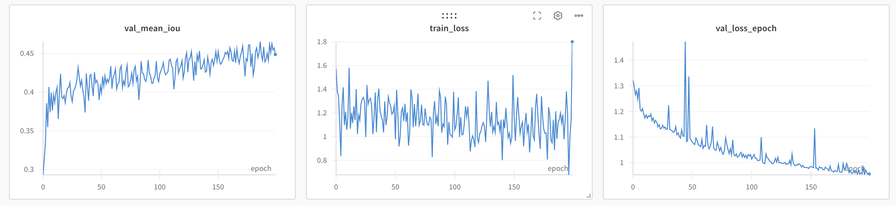
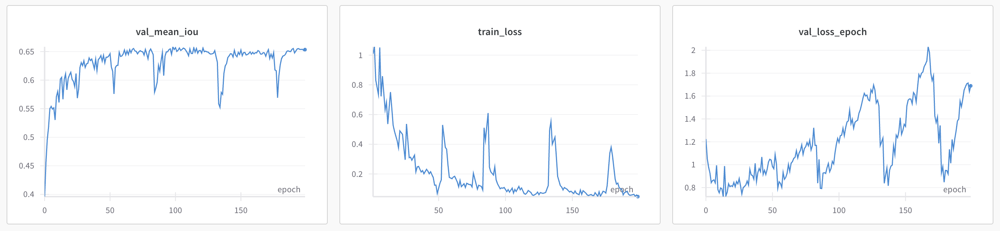
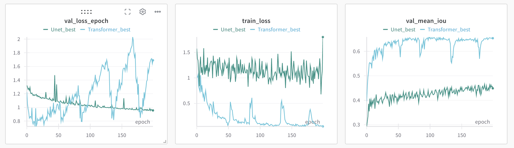
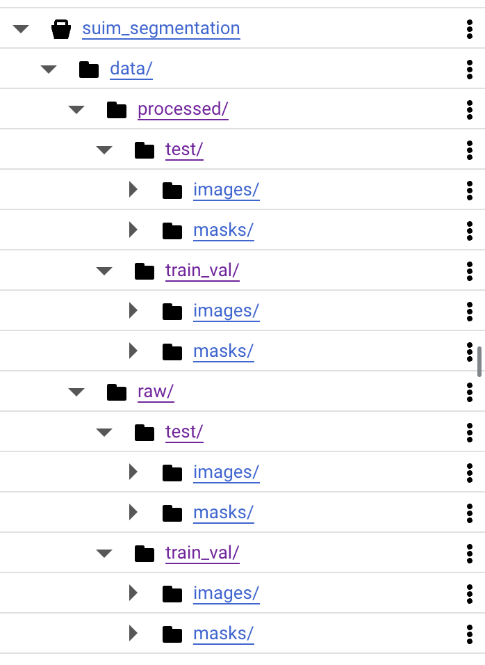
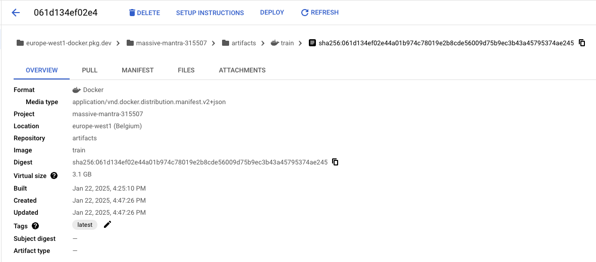
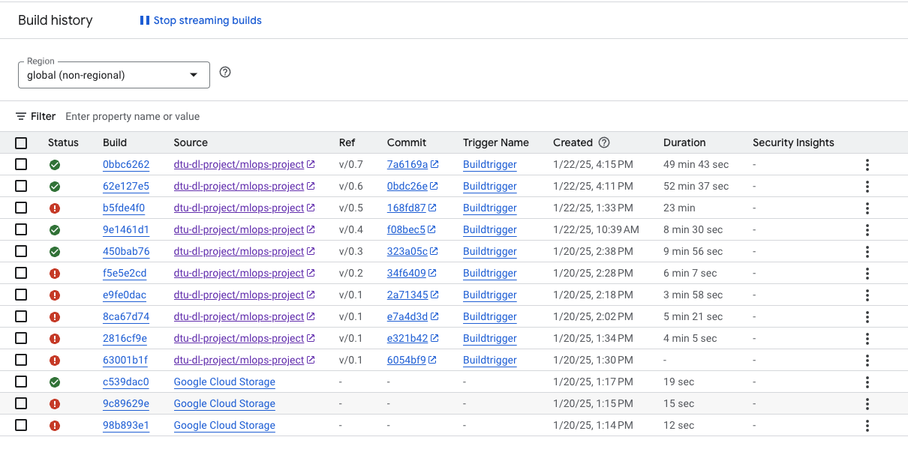

# Exam template for 02476 Machine Learning Operations

This is the report template for the exam. Please only remove the text formatted as with three dashes in front and behind
like:

```--- question 1 fill here ---```

Where you instead should add your answers. Any other changes may have unwanted consequences when your report is
auto-generated at the end of the course. For questions where you are asked to include images, start by adding the image
to the `figures` subfolder (please only use `.png`, `.jpg` or `.jpeg`) and then add the following code in your answer:

```markdown

```

In addition to this markdown file, we also provide the `report.py` script that provides two utility functions:

Running:

```bash
python report.py html
```

Will generate a `.html` page of your report. After the deadline for answering this template, we will auto-scrape
everything in this `reports` folder and then use this utility to generate a `.html` page that will be your serve
as your final hand-in.

Running

```bash
python report.py check
```

Will check your answers in this template against the constraints listed for each question e.g. is your answer too
short, too long, or have you included an image when asked. For both functions to work you mustn't rename anything.
The script has two dependencies that can be installed with

```bash
pip install typer markdown
```

## Overall project checklist

The checklist is *exhaustive* which means that it includes everything that you could do on the project included in the
curriculum in this course. Therefore, we do not expect at all that you have checked all boxes at the end of the project.
The parenthesis at the end indicates what module the bullet point is related to. Please be honest in your answers, we
will check the repositories and the code to verify your answers.

### Week 1

* [X] Create a git repository (M5)
* [X] Make sure that all team members have write access to the GitHub repository (M5)
* [X] Create a dedicated environment for you project to keep track of your packages (M2)
* [X] Create the initial file structure using cookiecutter with an appropriate template (M6)
* [X] Fill out the `data.py` file such that it downloads whatever data you need and preprocesses it (if necessary) (M6)
* [X] Add a model to `model.py` and a training procedure to `train.py` and get that running (M6)
* [X] Remember to fill out the `requirements.txt` and `requirements_dev.txt` file with whatever dependencies that you
    are using (M2+M6)
* [X] Remember to comply with good coding practices (`pep8`) while doing the project (M7)
* [X] Do a bit of code typing and remember to document essential parts of your code (M7)
* [ ] Setup version control for your data or part of your data (M8)
* [X] Add command line interfaces and project commands to your code where it makes sense (M9)
* [X] Construct one or multiple docker files for your code (M10)
* [X] Build the docker files locally and make sure they work as intended (M10)
* [X] Write one or multiple configurations files for your experiments (M11)
* [X] Used Hydra to load the configurations and manage your hyperparameters (M11)
* [X] Use profiling to optimize your code (M12)
* [X] Use logging to log important events in your code (M14)
* [X] Use Weights & Biases to log training progress and other important metrics/artifacts in your code (M14)
* [X] Consider running a hyperparameter optimization sweep (M14)
* [X] Use PyTorch-lightning (if applicable) to reduce the amount of boilerplate in your code (M15)

### Week 2

* [X] Write unit tests related to the data part of your code (M16)
* [X] Write unit tests related to model construction and or model training (M16)
* [X] Calculate the code coverage (M16)
* [X] Get some continuous integration running on the GitHub repository (M17)
* [X] Add caching and multi-os/python/pytorch testing to your continuous integration (M17)
* [X] Add a linting step to your continuous integration (M17)
* [X] Add pre-commit hooks to your version control setup (M18)
* [ ] Add a continues workflow that triggers when data changes (M19)
* [X] Add a continues workflow that triggers when changes to the model registry is made (M19)
* [X] Create a data storage in GCP Bucket for your data and link this with your data version control setup (M21)
* [X] Create a trigger workflow for automatically building your docker images (M21)
* [X] Get your model training in GCP using either the Engine or Vertex AI (M21)
* [X] Create a FastAPI application that can do inference using your model (M22)
* [X] Deploy your model in GCP using either Functions or Run as the backend (M23)
* [X] Write API tests for your application and setup continues integration for these (M24)
* [X] Load test your application (M24)
* [X] Create a more specialized ML-deployment API using either ONNX or BentoML, or both (M25)
* [ ] Create a frontend for your API (M26)

### Week 3

* [X] Check how robust your model is towards data drifting (M27)
* [X] Deploy to the cloud a drift detection API (M27)
* [X] Instrument your API with a couple of system metrics (M28)
* [ ] Setup cloud monitoring of your instrumented application (M28)
* [X] Create one or more alert systems in GCP to alert you if your app is not behaving correctly (M28)
* [X] If applicable, optimize the performance of your data loading using distributed data loading (M29)
* [X] If applicable, optimize the performance of your training pipeline by using distributed training (M30)
* [ ] Play around with quantization, compilation and pruning for you trained models to increase inference speed (M31)

### Extra

* [ ] Write some documentation for your application (M32)
* [ ] Publish the documentation to GitHub Pages (M32)
* [ ] Revisit your initial project description. Did the project turn out as you wanted?
* [ ] Create an architectural diagram over your MLOps pipeline
* [ ] Make sure all group members have an understanding about all parts of the project
* [ ] Uploaded all your code to GitHub

## Group information

### Question 1
> **Enter the group number you signed up on <learn.inside.dtu.dk>**
>
> Answer:

71

### Question 2
> **Enter the study number for each member in the group**
>
> Example:
>
> *sXXXXXX, sXXXXXX, sXXXXXX*
>
> Answer:

s243123, s243124, s243125, s243133

### Question 3
> **A requirement to the project is that you include a third-party package not covered in the course. What framework**
> **did you choose to work with and did it help you complete the project?**
>
> Recommended answer length: 100-200 words.
>
> Example:
> *We used the third-party framework ... in our project. We used functionality ... and functionality ... from the*
> *package to do ... and ... in our project*.
>
> Answer:

For our project, we chose to work with the **Hugging Face Transformers** library. We utilized its **SegformerForSemanticSegmentation** model and the **AutoImageProcessor** to process and segment images efficiently. The **Segformer** model, a transformer-based architecture, provided state-of-the-art performance for semantic segmentation tasks. The **AutoImageProcessor** allowed for seamless preprocessing of images before feeding them into the model, ensuring compatibility with the model's input requirements. This framework significantly streamlined the workflow, reducing the need for manual preprocessing and model configuration. It enabled us to focus on training and evaluation while leveraging pre-trained models, saving considerable development time. Overall, Hugging Face Transformers was instrumental in enhancing the accuracy and efficiency of our project, making it easier to integrate cutting-edge transformer models into our solution.

## Coding environment

> In the following section we are interested in learning more about you local development environment. This includes
> how you managed dependencies, the structure of your code and how you managed code quality.

### Question 4

> **Explain how you managed dependencies in your project? Explain the process a new team member would have to go**
> **through to get an exact copy of your environment.**
>
> Recommended answer length: 100-200 words
>
> Example:
> *We used ... for managing our dependencies. The list of dependencies was auto-generated using ... . To get a*
> *complete copy of our development environment, one would have to run the following commands*
>
> Answer:

In our project two different ways of managing dependecies were used: Conda and UV. Some components of the group used UV and other Conda, that are both package and environment manager.
However, after creating a virtual environment by using the chosen package manager, we have defined two files for installing dependencies: requirements.txt and requirements_dev.txt.
The first one includes Python package for running script while the other one Python packages for running the API.
Moreover, it's important also to build the project! So, concluding, for getting a complete copy of our development environment, one would have to run the following commands:
pip install -r requirements.txt --no-cache-dir --verbose
pip install -r requirements_dev.txt --no-cache-dir --verbose
pip install . --no-deps --no-cache-dir --verbose

### Question 5

> **We expect that you initialized your project using the cookiecutter template. Explain the overall structure of your**
> **code. What did you fill out? Did you deviate from the template in some way?**
>
> Recommended answer length: 100-200 words
>
> Example:
> *From the cookiecutter template we have filled out the ... , ... and ... folder. We have removed the ... folder*
> *because we did not use any ... in our project. We have added an ... folder that contains ... for running our*
> *experiments.*
>
> Answer:

We initialized our repository from the cookiecutter template provided. The important
parts we filled out were:
- the configs/ directory, where we put the configurations for our runs
- the dockerfiles/ directory, where we put the Dockerfiles
- the src/ directory, where we put the code to run the project
- the tests/ fodler, that contains both integration and unit testing

Also, we put some useful files in the root directory of the project. Some examples
are:
- cloudbuild.yaml that contains the steps that Google Cloud Build will follow
  to build and push the docker images to the registry
- environment files, that we used to store the Weight and Biases api key
- the run\_gcloud.py script that creates an instance running the api
  container image

### Question 6

> **Did you implement any rules for code quality and format? What about typing and documentation? Additionally,**
> **explain with your own words why these concepts matters in larger projects.**
>
> Recommended answer length: 100-200 words.
>
> Example:
> *We used ... for linting and ... for formatting. We also used ... for typing and ... for documentation. These*
> *concepts are important in larger projects because ... . For example, typing ...*
>
> Answer:

To ensure code quality and consistency, we implemented the following:

- **Linting and formatting**: We used `ruff` for linting and formatting. The `ruff` command was used to detect code style issues, and `ruff format` ensured consistent formatting across all files.
- **Pre-commit hooks**: We set up a `pre-commit` configuration to automate checks before committing code. This included:
  - Removing trailing whitespaces.
  - Fixing end-of-file issues.
  - Verifying YAML file integrity.
  - Running `ruff` for both linting and formatting tasks.
- **Typing**: We used type annotations in our code to ensure clarity and correctness. This added clarity for both developers and tools during static analysis.
- **Documentation**: Docstrings were used to describe the functionality of methods and classes. For example, each method in our `UNet` implementation includes detailed descriptions of its purpose, input shapes, and output shapes.

These practices are crucial in larger projects to ensure readability, prevent errors, and facilitate collaboration. For example, pre-commit hooks enforce code quality, while type annotations improve maintainability and debugging efficiency.

## Version control

> In the following section we are interested in how version control was used in your project during development to
> corporate and increase the quality of your code.

### Question 7

> **How many tests did you implement and what are they testing in your code?**
>
> Recommended answer length: 50-100 words.
>
> Example:
> *In total we have implemented X tests. Primarily we are testing ... and ... as these the most critical parts of our*
> *application but also ... .*
>
> Answer:

In total we have implemented 11 tests. Primarly we are testing that data is being correctly downloaded and loaded.
Moreover, the mapping of the classes is checked. The U-Net model is extensively analyzed to check for correct shapes of the various layers while since transformer is mostly a closed function from the library, was difficult to assert things regarding the model.
Finally the API is checked by using a GET operation and verifying that a response is sent.

### Question 8

> **What is the total code coverage (in percentage) of your code? If your code had a code coverage of 100% (or close**
> **to), would you still trust it to be error free? Explain you reasoning.**
>
> Recommended answer length: 100-200 words.
>
> Example:
> *The total code coverage of code is X%, which includes all our source code. We are far from 100% coverage of our **
> *code and even if we were then...*
>
> Answer:

The code coverage is 39% for the API, focusing on verifying basic operations like GET requests and ensuring responses are handled correctly. For data-related code, coverage is up to 50%, since most of the code is from the main function for loading data, used for doing the whole process of obtaining data, which are challenging to test. The model tests achieves 93% coverage because all components of the U-Net baseline, including layer shapes and functionality, have been tested.

Our testing approach focused on unit tests, with a GitHub hook ensuring these tests run automatically on every push. We intentionally avoided testing training, evaluation, and visualization due to time constraints in GitHub Actions and the inefficiency of re-downloading datasets with every push.

Even if the code had 100% coverage, it wouldn't guarantee it to be error-free. Coverage ensures that lines of code are executed during tests but doesn't confirm correctness or account for all edge cases. Logical errors, untested interactions between components, and issues with external dependencies can still occur.


### Question 9

> **Did you workflow include using branches and pull requests? If yes, explain how. If not, explain how branches and**
> **pull request can help improve version control.**
>
> Recommended answer length: 100-200 words.
>
> Example:
> *We made use of both branches and PRs in our project. In our group, each member had an branch that they worked on in*
> *addition to the main branch. To merge code we ...*
>
> Answer:

We did not use branches and pull requests in our workflow. Instead, we worked directly on the main branch by frequently pushing changes and using git pull --rebase to stay updated with the latest changes from our collaborators.
This approach made sense for our project because we had many small incremental ipdates. Hence, by making frequent pushes and using git pull --rebase, we ensured that our changes were continuously integrated with the latest updates, reducing the chance of large merge conflicts. Moreover, given the nature of our project, we opted for a streamlined approach that prioritized quick iteration and immediate feedback over the more formal process of pull requests.
While pull requests and branches are powerful tools for version control, especially in larger teams or projects with more complex workflows, they weren’t critical for this specific use case. Pull requests allow for code review, ensuring quality control and adherence to coding standards. They help in tracking changes and documenting why decisions were made.
For our project, however, the simplicity of a single branch aligned well with our objectives and helped us focus on rapid development and testing.

### Question 10

> **Did you use DVC for managing data in your project? If yes, then how did it improve your project to have version**
> **control of your data. If no, explain a case where it would be beneficial to have version control of your data.**
>
> Recommended answer length: 100-200 words.
>
> Example:
> *We did make use of DVC in the following way: ... . In the end it helped us in ... for controlling ... part of our*
> *pipeline*
>
> Answer:

No, we did not use DVC for managing data in our project as we worked with a static dataset. However, data version control would be highly beneficial in cases where the dataset evolves. For instance, it allows tracking the exact dataset version used to train each model, ensuring traceability and reproducibility.

When a model is deployed in production, new data often becomes available, requiring updates to the training set and model retraining. In such cases, DVC would help manage and version these incremental changes to the dataset. This ensures that any performance improvements or issues can be traced back to specific data versions.

Additionally, DVC would enable seamless collaboration in scenarios where multiple team members need to access or modify the dataset. By providing a structured history of dataset changes, it prevents accidental overwrites and helps in maintaining consistent workflows.

While not required for our static dataset, DVC is invaluable for dynamic, evolving datasets, especially in long-term projects or production pipelines.

### Question 11

> **Discuss you continuous integration setup. What kind of continuous integration are you running (unittesting,**
> **linting, etc.)? Do you test multiple operating systems, Python version etc. Do you make use of caching? Feel free**
> **to insert a link to one of your GitHub actions workflow.**
>
> Recommended answer length: 200-300 words.
>
> Example:
> *We have organized our continuous integration into 3 separate files: one for doing ..., one for running ... testing*
> *and one for running ... . In particular for our ..., we used ... .An example of a triggered workflow can be seen*
> *here: <weblink>*
>
> Answer:

Our continuous integration setup is organized into a single GitHub Actions workflow file named `Unit Tests`. This setup ensures the robustness and compatibility of our codebase across different environments. Key aspects of our CI pipeline include:

- **Testing Types**: We run both unit tests and integration tests to verify the correctness of individual modules and the interactions between them. Unit tests are located in the `tests/unit_tests/` directory, and integration tests in `tests/integration_tests/`.
- **Operating Systems**: Our CI tests the code on multiple operating systems, including `ubuntu-latest`, `windows-latest`, and `macos-latest`, to ensure platform compatibility.
- **Python Versions**: We validate our code against Python versions `3.12` and `3.11` using a matrix strategy.
- **Caching**: To speed up the workflow, we enable caching for Python dependencies using `pip` cache. This reduces redundant installations across runs.
- **Dependency Management**: Dependencies are installed from `requirements.txt`, `requirements_dev.txt`, and the project itself is installed to ensure accurate dependency resolution.

An example workflow trigger occurs on pushes or pull requests targeting the `main` branch. The workflow includes the following steps:
1. Code checkout using `actions/checkout@v4`.
2. Python setup using `actions/setup-python@v5` with caching enabled.
3. Installation of dependencies.
4. Running unit tests and integration tests with coverage reporting via `coverage`.

## Running code and tracking experiments

> In the following section we are interested in learning more about the experimental setup for running your code and
> especially the reproducibility of your experiments.

### Question 12

> **How did you configure experiments? Did you make use of config files? Explain with coding examples of how you would**
> **run a experiment.**
>
> Recommended answer length: 50-100 words.
>
> Example:
> *We used a simple argparser, that worked in the following way: Python  my_script.py --lr 1e-3 --batch_size 25*
>
> Answer:

We configured experiments using Hydra with separate config files for each model: `unet.yaml` and `transformer.yaml`. To train a model, run:
```bash
python src/segmentationsuim/train.py configs/unet.yaml
```
or use Invoke:
```bash
invoke train configs/unet.yaml
```
Similarly, for evaluation or visualization, use:
```bash
python src/segmentationsuim/evaluate.py configs/unet.yaml model.ckpt
python src/segmentationsuim/visualize.py configs/unet.yaml model.ckpt
invoke evaluate configs/unet.yaml model.ckpt
invoke visualize configs/unet.yaml model.ckpt
```
This approach ensures modularity and reproducibility.

### Question 13

> **Reproducibility of experiments are important. Related to the last question, how did you secure that no information**
> **is lost when running experiments and that your experiments are reproducible?**
>
> Recommended answer length: 100-200 words.
>
> Example:
> *We made use of config files. Whenever an experiment is run the following happens: ... . To reproduce an experiment*
> *one would have to do ...*
>
> Answer:

We ensured reproducibility using config files and comprehensive logging. Each experiment requires a config file specifying the model and hyperparameters, passed to the `train.py` script. Metrics are logged both in the terminal and to Weights & Biases for detailed tracking. Model checkpoints are saved in the `models/` directory with descriptive filenames, including the model type and hyperparameters.

Additionally, hyperparameters are embedded in the saved checkpoint, eliminating the need to provide them manually when reloading the model. To reproduce an experiment, you only need the `train.py` script and the original config file, as outlined in the previous answer.

For further consistency, we provided a Docker container that encapsulates the runtime environment. The container can be deployed using the `train.dockerfile`, ensuring consistent dependencies and settings across machines. This setup guarantees no information is lost and facilitates seamless experiment replication.

### Question 14

> **Upload 1 to 3 screenshots that show the experiments that you have done in W&B (or another experiment tracking**
> **service of your choice). This may include loss graphs, logged images, hyperparameter sweeps etc. You can take**
> **inspiration from [this figure](figures/wandb.png). Explain what metrics you are tracking and why they are**
> **important.**
>
> Recommended answer length: 200-300 words + 1 to 3 screenshots.
>
> Example:
> *As seen in the first image when have tracked ... and ... which both inform us about ... in our experiments.*
> *As seen in the second image we are also tracking ... and ...*
>
> Answer:

We used Weight and Biases for logging our experiments and we focused on three different metrics: the first one, and also the most important, is Mean Intersection over Unit (mIoU), which tells the percentage of pixels that have the same class with respect to the ground truth. An higher value of mIoU correspodns to a more precise prediction.
The second and third metrics are, as usual, train loss and validation loss, computed at the end of each epoch. We decided to not include in Weight and Biases the log of images during training since we had already the mIoU metric that is more concise and at the same time precise.
We focused on evaluating two different models, a Unet that worked as a baseline, and a fine tuned Transformer, that is our best model.




In the first image is represented the experiment for Unet
- **Validation Mean IOU**:
  - The mean IOU improves steadily, stabilizing around 100 epochs, indicating that the model is learning
- **Training Loss**:
  - Training loss reduces over time but with some spikes, maybe due to learning rate.
- **Validation Loss**:
  - Decreases consistently, showing good generalization



In the second image is represented the experiment for Transformer
- **Validation Mean IOU**:
  - Achieves higher IOU early, stabilizing before UNet.
- **Training Loss**:
  - Stable training loss.
- **Validation Loss**:
  - Increases after 100 epochs, potentially from overfitting, while the meanIoU still increases.



- Transformer shows better performance initially but overfits as epochs progress.
- UNet remains more stable, though with higher overall loss.
- UNet exhibits more fluctuation; Transformer is more stable.
- Transformer achieves higher IOU


### Question 15

> **Docker is an important tool for creating containerized applications. Explain how you used docker in your**
> **experiments/project? Include how you would run your docker images and include a link to one of your docker files.**
>
> Recommended answer length: 100-200 words.
>
> Example:
> *For our project we developed several images: one for training, inference and deployment. For example to run the*
> *training docker image: `docker run trainer:latest lr=1e-3 batch_size=64`. Link to docker file: <weblink>*
>
> Answer:

For our project, we developed several Docker images, each designed for specific
tasks such as training, evaluation, API deployment, and visualization. These
containerized environments ensure reproducibility and portability across
different systems.

For instance, our **CPU training Docker image** is defined in `train.dockerfile`.
It uses the `python:3.11-slim` base image and installs the necessary
dependencies via `pip`. Additionally, the training script is set as the entry
point, with configurations and environment variables included in the image.

To build and run the training Docker image, the following commands are used:

```bash
docker build -f dockerfiles/train.dockerfile -t training-image:latest .
```

```bash
docker run training-image:latest
```

**Link to the training Dockerfile**: [train.dockerfile](../dockerfiles/train.dockerfile)

Other Dockerfiles include:
- `train.gpu.dockerfile` for training on the GPU.
- `evaluate.dockerfile` for evaluation tasks.
- `api.dockerfile` for API deployment.
- `visualize.dockerfile` for generating visualizations.

This modular approach ensures each image is optimized for its intended use, simplifying deployment and improving maintainability.

### Question 16

> **When running into bugs while trying to run your experiments, how did you perform debugging? Additionally, did you**
> **try to profile your code or do you think it is already perfect?**
>
> Recommended answer length: 100-200 words.
>
> Example:
> *Debugging method was dependent on group member. Some just used ... and others used ... . We did a single profiling*
> *run of our main code at some point that showed ...*
>
> Answer:

During our development process, we utilized both the VSCode debugger and the Python Debugger (pdb), as the latter was recommended during the guest lecture. These tools provided invaluable assistance in identifying issues and understanding our code behavior in depth.

One of the key features we leveraged was the ability to set breakpoints, which allowed us to monitor the shapes of tensors dynamically during runtime. This proved crucial in verifying the correctness of tensor transformations and testing specific commands we were uncertain about. The immediate feedback offered by this approach helped us debug effectively and refine our implementation.

Additionally, we employed profiling techniques to address performance concerns. Specifically, we noticed that image loading was noticeably slow for certain images. Through careful analysis using the profiler, we identified bottlenecks in our data pipeline and took steps to mitigate these issues.

As a result of our debugging and profiling efforts, we also uncovered errors in the originally used dataset. This discovery led us to investigate further, and the issues were resolved in a newer version of the dataset. Overall, the combined use of debugging tools and profiling enhanced our understanding of the code and improved its efficiency and accuracy.


## Working in the cloud

> In the following section we would like to know more about your experience when developing in the cloud.

### Question 17

> **List all the GCP services that you made use of in your project and shortly explain what each service does?**
>
> Recommended answer length: 50-200 words.
>
> Example:
> *We used the following two services: Engine and Bucket. Engine is used for... and Bucket is used for...*
>
> Answer:

We used the following Google Cloud Platform (GCP) services in our project:

- **Artifact Registry**: Used to securely store and manage Docker container
  images required for our workflows.
- **Cloud Storage Bucket**: Utilized to store and manage datasets, ensuring
  accessibility and durability for training and testing.
- **Vertex AI**: Used to train machine learning models at scale, leveraging its
  managed infrastructure and tools for efficient experimentation.
- **Cloud Run**: Employed to deploy our containerized API services, providing a
  scalable and serverless environment for hosting.
- **Cloud Build Triggers**: Automated the CI/CD pipeline by integrating with
  our GitHub repository to build and deploy Docker images upon code changes.

These services together provided a seamless and scalable infrastructure to
handle data storage, model training, container management, and deployment.

### Question 18

> **The backbone of GCP is the Compute engine. Explained how you made use of this service and what type of VMs**
> **you used?**
>
> Recommended answer length: 100-200 words.
>
> Example:
> *We used the compute engine to run our ... . We used instances with the following hardware: ... and we started the*
> *using a custom container: ...*
>
> Answer:

In our project, we did not directly utilize Compute Engine VMs because our
workflows were designed to leverage other GCP services that eliminated the need
for managing individual virtual machines.

For model training, we used **Vertex AI**, which allowed us to upload container
images and handle training tasks without manually provisioning or managing VMs.
Vertex AI abstracts the underlying infrastructure while still providing
high-performance environments for training.

Similarly, for deploying our API, we used **Cloud Run**, which enabled
serverless deployment of containerized applications. This service automatically
managed scaling and infrastructure, further reducing the need for Compute
Engine instances.

By relying on these managed services, we avoided the complexity of provisioning
and maintaining Compute Engine VMs, ensuring our project remained efficient and
focused on core functionalities.

### Question 19 -> Lore inserisci la tua

> **Insert 1-2 images of your GCP bucket, such that we can see what data you have stored in it.**
> **You can take inspiration from [this figure](figures/bucket.png).**
>
> Answer:



### Question 20

> **Upload 1-2 images of your GCP artifact registry, such that we can see the different docker images that you have**
> **stored. You can take inspiration from [this figure](figures/registry.png).**
>
> Answer:




### Question 21

> **Upload 1-2 images of your GCP cloud build history, so we can see the history of the images that have been build in**
> **your project. You can take inspiration from [this figure](figures/build.png).**
>
> Answer:



### Question 22

> **Did you manage to train your model in the cloud using either the Engine or Vertex AI? If yes, explain how you did**
> **it. If not, describe why.**
>
> Recommended answer length: 100-200 words.
>
> Example:
> *We managed to train our model in the cloud using the Engine. We did this by ... . The reason we choose the Engine*
> *was because ...*
>
> Answer:

Yes, we successfully trained our model in the cloud using **Vertex AI**. This
was achieved through a script (`run_gcloud.py`) that automated the process of
configuring and launching a training job in Vertex AI.

The script performs the following steps:
1. Logs in to **Weights & Biases (WandB)** to retrieve the API key required for
   tracking experiments.
2. Defines a training configuration in YAML format, specifying:
   - The machine type (`n1-highmem-2`) for the training job.
   - The Docker image containing our training code, hosted in Artifact
     Registry.
   - Environment variables, such as the WandB API key, to be passed to the
     container.
3. Saves the configuration to a file (`train_config.yaml`).
4. Constructs and executes a `gcloud` command to create a Vertex AI custom
training job in the `europe-west1` region.

Using this setup, we leveraged Vertex AI's managed infrastructure to handle our
training workloads efficiently, without needing to manually provision and
maintain virtual machines. This approach streamlined the process and ensured
scalability for our experiments.

## Deployment

### Question 23 -> Lore dai check

> **Did you manage to write an API for your model? If yes, explain how you did it and if you did anything special. If**
> **not, explain how you would do it.**
>
> Recommended answer length: 100-200 words.
>
> Example:
> *We did manage to write an API for our model. We used FastAPI to do this. We did this by ... . We also added ...*
> *to the API to make it more ...*
>
> Answer:

We created an API for the project using FastAPI, designed to handle image segmentation tasks. The main function is to have the possibility of choosing which model to use between Unet and Transformer and then, by uplaoding the images, the API will give it back the segmented images using the model chosen.
Predictions are processed asynchronously to reduce latency.
The API integrates Prometheus metrics to track total requests, errors, and the time taken for predictions. Moreover, it has been included data drifting for detecting changes in the data and in the predictions triggered by some metrics like average brightness, contrast and sharpness of the input images.
There is also a part of error handling for being sure that invalid input will not given as input.


### Question 24

> **Did you manage to deploy your API, either in locally or cloud? If not, describe why. If yes, describe how and**
> **preferably how you invoke your deployed service?**
>
> Recommended answer length: 100-200 words.
>
> Example:
> *For deployment we wrapped our model into application using ... . We first tried locally serving the model, which*
> *worked. Afterwards we deployed it in the cloud, using ... . To invoke the service an user would call*
> *`curl -X POST -F "file=@file.json"<weburl>`*
>
> Answer:

We implemented the deploy of our API both locally and on cloud. Firstly, we created ad hoc docker files for containirizing all needed for the API working. By building that image and then by running the image by invoking -docker run -d -p 8080:8080 "image-name"-, you can access the API locally at "http://localhost:8080" and for using it it's suggested to visit "http://localhost:8080/docs".
We deployed on Cloud Run, by building the image (for linux) and pushing it to the the artifact register. Once it's pushed, it's possible to deploy the run by invoking this command
    "gcloud run deploy api \
    --image europe-west1-docker.pkg.dev/project-id/api/api:latest \
    --platform managed \
    --region europe-west1 \
    --allow-unauthenticated \
    --memory=4Gi \"
It's important to use the flag memory because the default setting is imposed to 512Mb that it's not enough. Then, after the deployment, it will be provided a URL of this type "https://segmentation-api-xyz.a.run.app" and as before, for using it, it is suggested to visit "https://segmentation-api-xyz.a.run.app/docs".
If the API is already deployed and accessible (either locally or on GCloud), by invoking "curl URL" will be possible to use it.
For discovering a little bit more about prometheus metrics, it's possible to visit /metrics page.

### Question 25 -> Lore lancia un locust e aggiorna ultima parte coi dati mediani

> **Did you perform any unit testing and load testing of your API? If yes, explain how you did it and what results for**
> **the load testing did you get. If not, explain how you would do it.**
>
> Recommended answer length: 100-200 words.
>
> Example:
> *For unit testing we used ... and for load testing we used ... . The results of the load testing showed that ...*
> *before the service crashed.*
>
> Answer:

We performed both unit testing and load testing for the API.
Unit testing was conducted using **FastAPI's TestClient**. Below are the key points:

- **Root Endpoint (`/`)**:
  - Verified the HTTP status code is `200`.
  - Ensured the response contains the expected welcome message:
    ```json
    {
      "message": "Welcome to the API for segment your underwater image. You can choose between two different models: unet and transformer. Upload your image and see the magic!!"
    }
    ```

This test confirmed that the API's basic functionality is intact and correctly implemented.
Load testing was conducted using **Locust** to simulate concurrent user activity.
A task was created to:
  - Randomly select a model type (`unet` or `transformer`).
  - Send POST requests with an image to the `/predict/` endpoint.
- The test targeted the deployed API at:
https://api-288862848403.europe-west1.run.app or the chosen URL

**Median Response Time**:
- **81ms** for `transformer`.
- **85ms** for `unet`.
- **Requests Per Second (RPS)**: **0.7** aggregated across all tasks.
- **Failures**: None recorded.


### Question 26

> **Did you manage to implement monitoring of your deployed model? If yes, explain how it works. If not, explain how**
> **monitoring would help the longevity of your application.**
>
> Recommended answer length: 100-200 words.
>
> Example:
> *We did not manage to implement monitoring. We would like to have monitoring implemented such that over time we could*
> *measure ... and ... that would inform us about this ... behaviour of our application.*
>
> Answer:

Yes, we managed to implement monitoring for my deployed model.

Used Prometheus to track API performance metrics, including:

    - `api_requests_total`: Total number of API requests received.
    - `api_errors_total`: Total number of errors encountered.
    - `classification_time_seconds`: Time taken to process predictions.
  - These metrics are exposed via the `/metrics` endpoint, which can be scraped by a Prometheus instance for real-time monitoring.

**Current Setup**:
  - Prometheus is not connected in the cloud, but the metrics are ready for integration with a monitoring system.

 Implemented a **data drifting detection system** to monitor changes in input data and model predictions.
- Key metrics tracked:
  - Average brightness.
  - Contrast.
  - Sharpness of input images.

A **trigger system** monitors the number of concurrent requests. If the requests exceed a defined threshold an alert is raised to prevent server overload.


## Overall discussion of project

> In the following section we would like you to think about the general structure of your project.

### Question 27

> **How many credits did you end up using during the project and what service was most expensive? In general what do**
> **you think about working in the cloud?**
>
> Recommended answer length: 100-200 words.
>
> Example:
> *Group member 1 used ..., Group member 2 used ..., in total ... credits was spend during development. The service*
> *costing the most was ... due to ... . Working in the cloud was ...*
>
> Answer:

--- question 27 fill here ---

### Question 28 -> Lore

> **Did you implement anything extra in your project that is not covered by other questions? Maybe you implemented**
> **a frontend for your API, use extra version control features, a drift detection service, a kubernetes cluster etc.**
> **If yes, explain what you did and why.**
>
> Recommended answer length: 0-200 words.
>
> Example:
> *We implemented a frontend for our API. We did this because we wanted to show the user ... . The frontend was*
> *implemented using ...*
>
> Answer:

--- question 28 fill here ---

### Question 29

> **Include a figure that describes the overall architecture of your system and what services that you make use of.**
> **You can take inspiration from [this figure](figures/overview.png). Additionally, in your own words, explain the**
> **overall steps in figure.**
>
> Recommended answer length: 200-400 words
>
> Example:
>
> *The starting point of the diagram is our local setup, where we integrated ... and ... and ... into our code.*
> *Whenever we commit code and push to GitHub, it auto triggers ... and ... . From there the diagram shows ...*
>
> Answer:

--- question 29 fill here ---

### Question 30

> **Discuss the overall struggles of the project. Where did you spend most time and what did you do to overcome these**
> **challenges?**
>
> Recommended answer length: 200-400 words.
>
> Example:
> *The biggest challenges in the project was using ... tool to do ... . The reason for this was ...*
>
> Answer:

--- question 30 fill here ---

### Question 31

> **State the individual contributions of each team member. This is required information from DTU, because we need to**
> **make sure all members contributed actively to the project**
>
> Recommended answer length: 50-200 words.
>
> Example:
> *Student sXXXXXX was in charge of developing of setting up the initial cookie cutter project and developing of the*
> *docker containers for training our applications.*
> *Student sXXXXXX was in charge of training our models in the cloud and deploying them afterwards.*
> *All members contributed to code by...*
>
> Answer:

--- question 31 fill here ---
